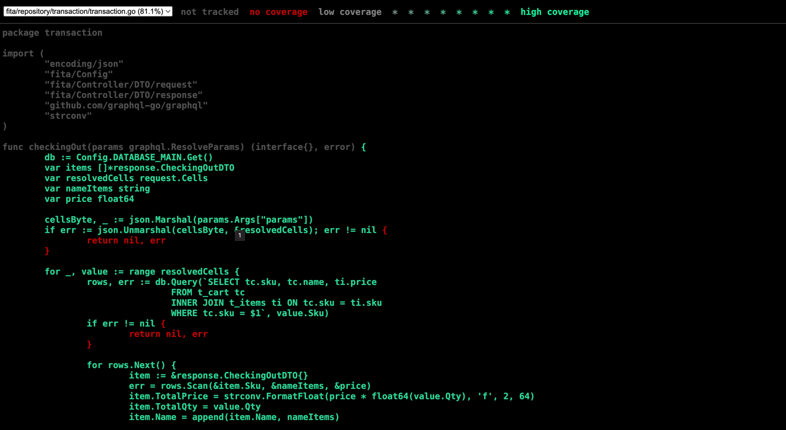
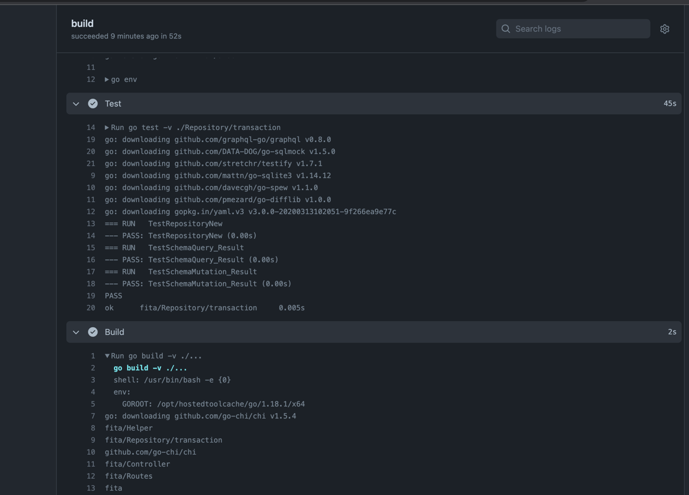

# fita

#API Service Backend

API root :
{{host}}/transaction

Method :
Post

- Body Request add to cart :
  `{
      "mutation": "{addToCart (sku: \"43N23P\", name:\"MacBook Pro 1\", qty: 1) {sku, name, qty}}"
  }`

- Body Request checkout :
  `{
      "query": "{items(params:[{sku: \"A304SD\", qty:3}, {sku: \"120P90\", qty:2}, {sku: \"43N23P\", qty: 1}]) {sku, name, total_price, total_qty}}"
  }`

Expected Result :
- add to cart
  `{
  "status": "OK",
  "data": {
  "addToCart": {
  "name": "MacBook Pro",
  "qty": 1,
  "sku": "43N23P"
  }
  },
  "code": 200,
  "accessTime": "06-05-2022 05:55:17"
  }`
- checkout with promo :
  `{
  "status": "OK",
  "data": {
  "items": [
  {
  "name": "[Alexa Speaker]",
  "sku": "A304SD",
  "total_price": "295.65",
  "total_qty": 3
  },
  {
  "name": "[Google Home]",
  "sku": "120P90",
  "total_price": "99.98",
  "total_qty": 2
  },
  {
  "name": "[MacBook Pro Raspberry Pi B]",
  "sku": "43N23P",
  "total_price": "5399.99",
  "total_qty": 1
  }
  ]
  },
  "code": 200,
  "accessTime": "05-05-2022 16:28:12"
  }`

